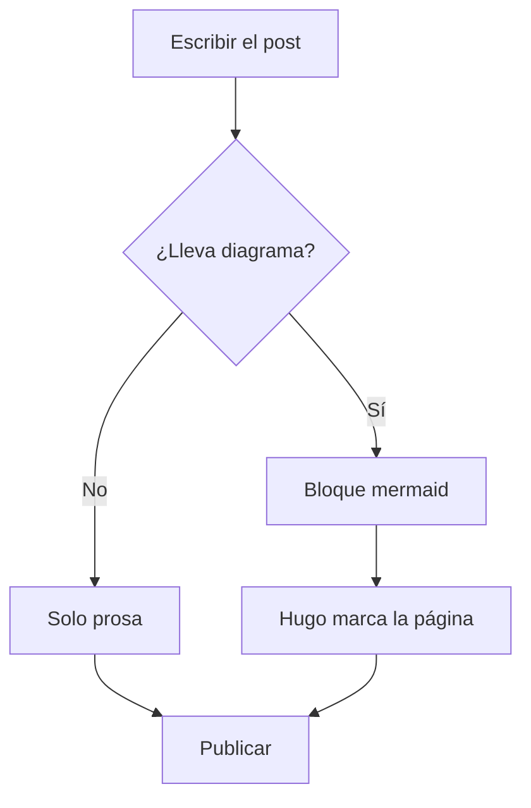
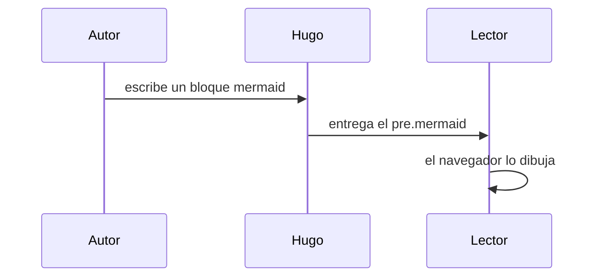

Vulpine Marrow carga [mermaid](https://mermaid.js.org/) solo en las páginas que
lo necesitan, y elige la paleta según el modo activo: si cambiás entre claro y
oscuro, los diagramas se vuelven a dibujar con los colores correctos. Después de
leer la introducción en [[bienvenida]], este es el mejor lugar para verlo.

## Un flujo de decisión

Un `flowchart` se escribe como un bloque de código con el lenguaje `mermaid`:

## Una secuencia

Los diagramas de secuencia también funcionan, útiles para describir un
intercambio entre partes:

## Imágenes con caption

El shortcode `figure` resuelve la imagen como recurso del *page bundle* y le
agrega pie y crédito:



Para posts de inteligencia o material sensible, el banner TLP deja clara la
clasificación de un vistazo:

distribución limitada — material de ejemplo

Si te interesan el resto de los bloques reutilizables, seguí por la
[[caja-de-herramientas]].
